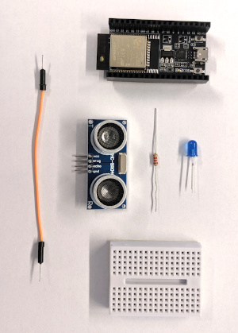
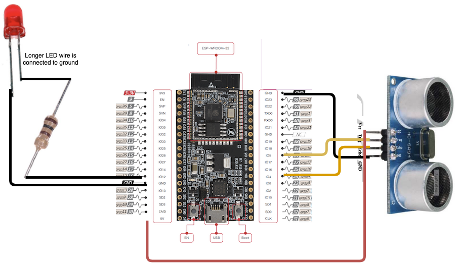
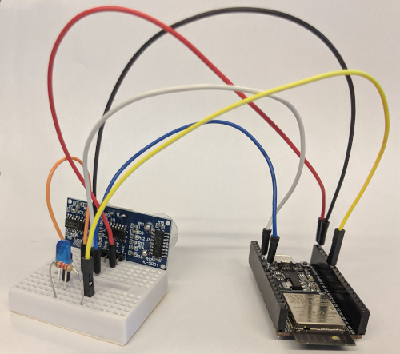

# Materials 
This should be in the kit:

* ESP32 DevKitC microcontroller
* HC-SR04 ultrasonic range finder
* LED
* Jumper cables
* Breadboard
* Low-resistance resistor (we used a 100&Omega; resistor)
* 6 male to male jumpers (use 5 female to male and one male to male if your esp32 has male headers)
* 1 breadboard

## Circuit diagram

## Assembled circuit
